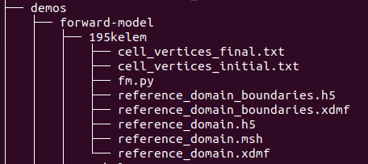

<h1 align="center">Modeling Valve Interstitial Cells with JAX-FEM</h1>
<p align="center">
  <b>Directions on installing and running forward/inverse models to recover a stiffness field of activated cell microenvironments. </b></br>
  <sub><sub>
</p>

<br />

# Download CARDIAX or JAX-FEM 
Follow the below commands:
1. Create and Activate Virtual Environment
```bash
mkdir virtual_environments && python3 -m venv virtual_environments/jax_fem_env && source virtual_environments/jax_fem_env/bin/activate
```
3. Install all required packages for gmsh; may not be necessary
```bash
sudo apt-get -y install libglu1 libxcursor-dev libxft2 libxinerama1 libfltk1.3-dev libfreetype6-dev libgl1-mesa-dev
```
5. Install JAX-FEM
```bash
git clone https://github.com/deepmodeling/jax-fem.git && cd jax-fem && pip install -e .
```
7. Install all package requirements
```bash
cd ../CARDIAX && chmod +x install.sh && ./install.sh
```
9. Install JAX-FEM
```bash
pip install -e .
```
10. Install JAX on GPU (optional, without this command, JAX-FEM will be using CPU)
```bash
pip install -U "jax[cuda12]"
```
11. Run CARDIAX unittests
```bash
python3 tests/benchmarks/nodal_stress/test_nodal_stress.py
```

Note: commands are inspired/modified from Gabriel Peery's work (CARDIAX/.github/workflows/github-actions-demo.yml). 

To ensure JAX is installed on GPU, run:
  from jax.lib import xla_bridge
  print(xla_bridge.get_backend().platform)

This should print 'gpu' or 'cpu' based on installation process.
  
# Setting Up Forward Model and Inverse Models 
In folder jax-fem (which contains problem, solver, mesh, utils, etc. codes):
1. use fwd_* when running forward model codes
2. use inv_* when running inverse model codes
3. orig_* represents the original jax-fem repository codes
4. any files that do not have fwd_* or inv_* are common to both the forward and inverse model (do not need to change anything)

For the inverse model, the variable gamma (the constant for total variance) will need to be adjusted. 

1. fm.py represents forward model code load stepping is done within fm.py (fwd_solver.py does not contain load stepping). To increase number of load steps, adjust variable num_steps.
2. fm_savedata.py saves the current alpha field and Jacobian of the deformation gradient (in addition to the solution displacement matrix) to the output .vtu file.
3. im.py represents inverse model codeload stepping is done within inv_solver.py, and is dependent on mesh files (cell position/displacement) in inverse-model folder. To increase number of load steps, adjust variable XXX in inv_solver.py. 19kelem (~19,000 elements in mesh), XXX represent different mesh folders with the respective required data for each of the mesh sizes. 

After cloning either the JAX-FEM or CARDIAX repositories and downloading JAX-FEM, to run forward model code with a 195,000 element mesh: 
1. in CARDIAX/demos, create a new folder forward-model.
2. in CARDIAX/demos/forward-model, copy in the appropriate mesh folder (195kelem).
3. in CARDIAX/demos/forward-model, also copy in the forward model code (fm.py).
Ultimately, CARDIAX/demos should look like:


4. in the CARDIAX/jax-fem directory, copy the fwd* files as *.py; for example, copy fwd_solver.py to solver.py. Or, you could modify fm.py, problem.py (and all respective files involved with the solver.py) to instead access fwd_solver.py
5. navigate to CARDIAX/demos/forward-model/195kelem and use "python3 fm.py" to run model.

A similar process can be done to run the inverse model. Note that the directory structure is not fixed; however, you would need to change the file paths (im_solver.py uses the mesh/cell_vertices* files).

